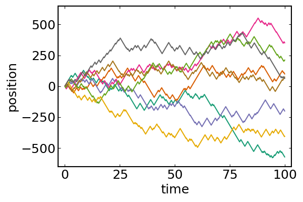
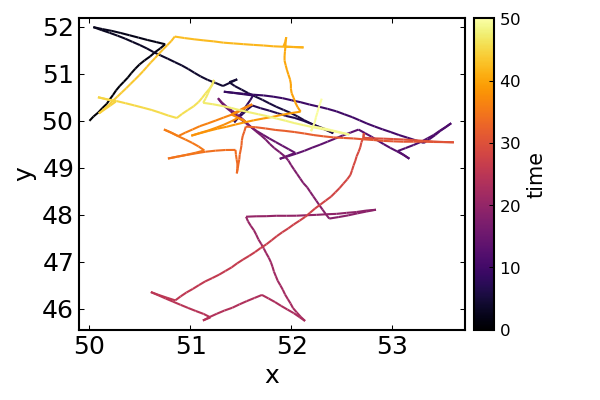

# Tutorial
Ready-to-run scripts for the functionalities introduced here can be found in the `examples` directory of the [repo](https://github.com/mastrof/BacteriaBasedModels).

## Creating a bacterium
Bacteria are represented by custom types, that must be subtypes of the `AbstractAgent` type implemented by Agents.jl.
```@docs
AbstractMicrobe
```
By default, BacteriaBasedModels provides a basic `Microbe` type, that is usually sufficient for the simplest types of simulations.
```@docs
Microbe
```

In order to create a `Microbe` living in a one-dimensional space we can just call
```julia
Microbe{1}(id=0)
```
It is *required* to pass a value to the `id` argument (this behavior might change in the future).
All the other parameters will be given default values (as described in the type docstring) if not assigned explicitly.

Similarly, for bacteria living in two or three dimensions we can use
```julia
Microbe{2}(id=0)
Microbe{3}(id=0)
```

Custom parameters can be set via kwargs:
```julia
Microbe{3}(
    id = 0,
    pos = (300.0, 0.0, 0.0),
    motility = RunTumble(speed = Normal(40.0, 4.0)),
    vel = rand_vel(3) .* 40.0,
    turn_rate = 1.5,
    state = 0.0,
    rotational_diffusivity = 0.035,
    radius = 0.5
)
```

## Creating a model
BacteriaBasedModel provides a fast way to initialise an `AgentBasedModel` (from Agents.jl) via the
`initialise_model` function, using a typical procedure.
If higher levels of customization are needed, the model will need to be created by hand.
```@docs
initialise_model
```

We can now generate a population of microbes and, after choosing an integration timestep and a domain size, we initialise our model, placing the microbes at random locations in the domain.
```julia
microbes = [Microbe{3}(id=i) for i in 1:10]
timestep = 0.1
extent = 100.0
model = initialise_model(;
    microbes = microbes,
    timestep = timestep,
    extent = extent
)
```

```
AgentBasedModel with 10 agents of type Microbe
 space: periodic continuous space with (100.0, 100.0, 100.0) extent and spacing=5.0
 scheduler: fastest
 properties: timestep
```


## Random walks
Now we can already generate random walks.
The setup follows previous sections.
```julia
dt = 0.1
L = 100.0
nmicrobes = 8
microbes = [Microbe{1}(id=i, pos=(L/2,)) for i in 1:nmicrobes]

model = initialise_model(;
    microbes = microbes,
    timestep = dt,
    extent = L, periodic = false,
    random_positions = false
)
```

Now we need to define the `adata` variable to choose what observables we want to track, throughout the simulation, for each agent in the system. In our case, only the position field
```julia
adata = [:pos]
```
Now we can run the simulation; the `microbe_step!` function will take care of the stepping and reorientations:
```julia
nsteps = 1000
adf, = run!(model, microbe_step!, nsteps; adata)
```

```julia
x = vectorize_adf_measurement(adf, :pos) .|> first
plot(
    (0:nsteps).*dt, x',
    legend = false,
    xlab = "time",
    ylab = "position"
)
```


Similarly for a two-dimensional random walk, using run-reverse-flick motility and non-zero rotational diffusion:
```julia
dt = 0.1
L = 100.0
nmicrobes = 1
microbes = [
    Microbe{2}(
        id=i, pos=(L/2,L/2),
        motility=RunReverseFlick(),
        rotational_diffusivity = 0.02,
        ) for i in 1:nmicrobes
]

model = initialise_model(;
    microbes = microbes,
    timestep = dt,
    extent = extent, periodic = false,
    random_positions = false,
)

nsteps = 500
adata = [:pos]
adf, = run!(model, microbe_step!, nsteps; adata)

traj = vectorize_adf_measurement(adf, :pos)
x = first.(traj)
y = last.(traj)
plot(
    x', y', line_z = (0:nsteps).*dt,
    legend=false,
    xlab = "x", ylab = "y",
    colorbar = true, colorbar_title = "time"
)
```



Microbes with different motile patterns can also be combined in the same simulation, without extra complications or computational costs:
```julia
n = 3
microbes_runtumble = [Microbe{2}(id=i, motility=RunTumble()) for i in 1:n]
microbes_runrev = [Microbe{2}(id=n+i, motility=RunReverse()) for i in 1:n]
microbes_runrevflick = [Microbe{2}(id=2n+1, motility=RunReverseFlick()) for i in 1:n]
microbes = vcat(
    microbes_runtumble, microbes_runrev, microbes_runrevflick
)
```

## Velocity autocorrelation functions
It's important to check that our microbes are behaving as expected.
A way to do so is running a simulation with different motile patterns, and compare their velocity autocorrelation functions to theoretical expectations (*Taktikos et al. 2013 PLoS ONE*).

First, let's set our parameters
```julia
U = 30.0 # μm/s
τ_run = 1.0 # s
ω = 1 / τ_run # 1/s
Δt = 0.01 # s
L = 1e4 # μm
```
then we can generate three distinct microbe populations, differing only in their motility, merge them all into a single population and initialise our model
```julia
n = 200
microbes_runtumble = [
    Microbe{3}(id=i,
        turn_rate=ω, vel=rand_vel(3).*U,
        motility=RunTumble(speed=Degenerate(U))
    )
    for i in 1:n
]
microbes_runrev = [
    Microbe{3}(id=n+i,
        turn_rate=ω, vel=rand_vel(3).*U,
        motility=RunReverse(speed=Degenerate(U))
    )
    for i in 1:n
]
microbes_runrevflick = [
    Microbe{3}(id=2n+i,
        turn_rate=ω, vel=rand_vel(3).*U,
        motility=RunReverseFlick(speed=Degenerate(U))
    )
    for i in 1:n
]

microbes = vcat(
    microbes_runtumble, microbes_runrev, microbes_runrevflick
)

model = initialise_model(;
    microbes = microbes,
    timestep = Δt,
    extent = L, periodic = true
)
```

To evaluate the velocity autocorrelation functions, we only need to store the `:vel` field of the microbes during the simulation.
To get a good statistics we need simulation times that are sufficiently longer than the average run length `τ_run`.
```julia
nsteps = round(Int, 100τ_run / Δt)
adata = [:pos, :vel]
adf, = run!(model, microbe_step!, nsteps; adata)
```

We can now separate the three subpopulations by their indices (more generally we could also directly filter by the motility type) and evaluate their velocity autocorrelation functions using the built-in `autocorrelation` function
```julia
adf_runtumble = filter(:id => id -> 1≤id≤n, adf; view=true)
adf_runrev = filter(:id => id -> n+1≤id≤2n, adf; view=true)
adf_runrevflick = filter(:id => id -> 2n+1≤id≤3n, adf; view=true)
adfs = [adf_runtumble, adf_runrev, adf_runrevflick]

Φ = hcat([autocorrelation(a,:vel) for a in adfs]...)
```

The theoretical values are given by *Taktikos et al. 2013 PLoS ONE*
```julia
t = range(0, (nsteps-1)*Δt; step=Δt)
ϕ = hcat([
    exp.(-t ./ τ_run),
    exp.(-t ./ (τ_run / 2)),
    (1 .- t ./ (2τ_run)) .* exp.(-t ./ τ_run),
]...)
```

A comparison shows a great agreement between simulation and theory.
```julia
plot(
    xlims=(0,6τ_run), ylims=(-0.1, 1.05),
    xlab="Δt / τ",
    ylab="velocity autocorrelation",
)
plot!(t, ϕ, lw=2, lc=[1 2 3],
    label=["Run-Tumble" "Run-Reverse" "Run-Reverse-Flick"])
scatter!(t[1:10:end], Φ[1:10:end,:] ./ U^2, m=:x, mc=[1 2 3],
    label=false)
```
